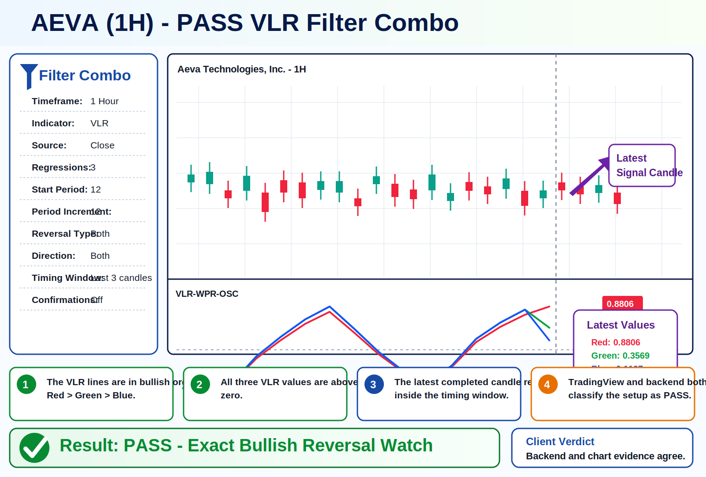
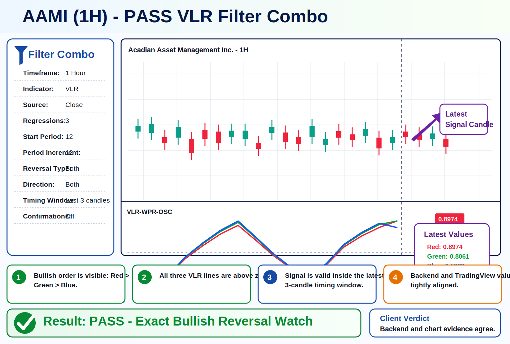
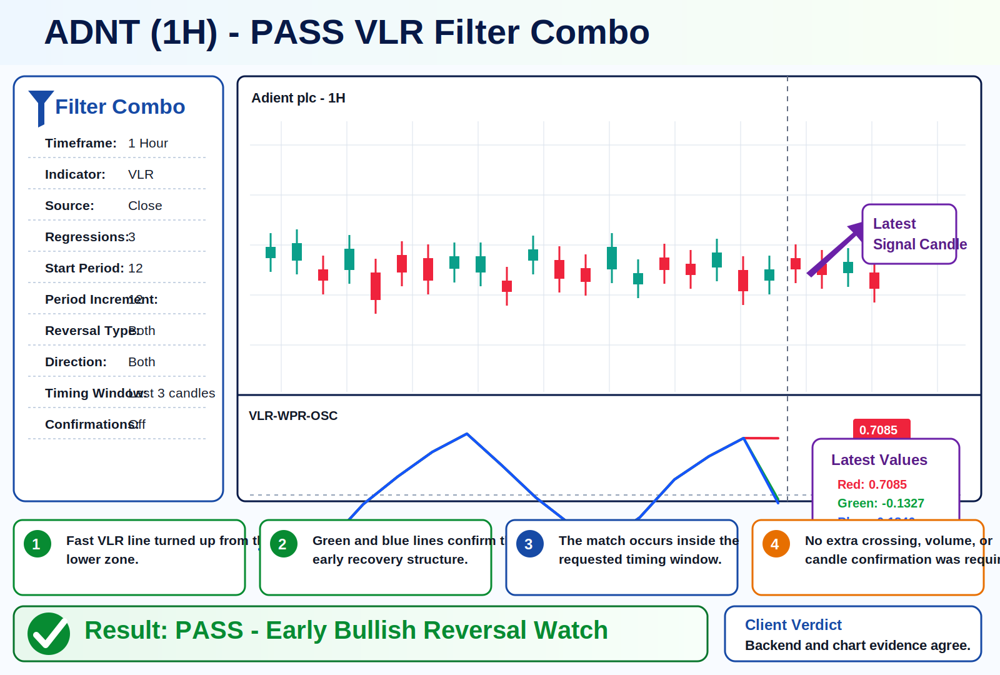
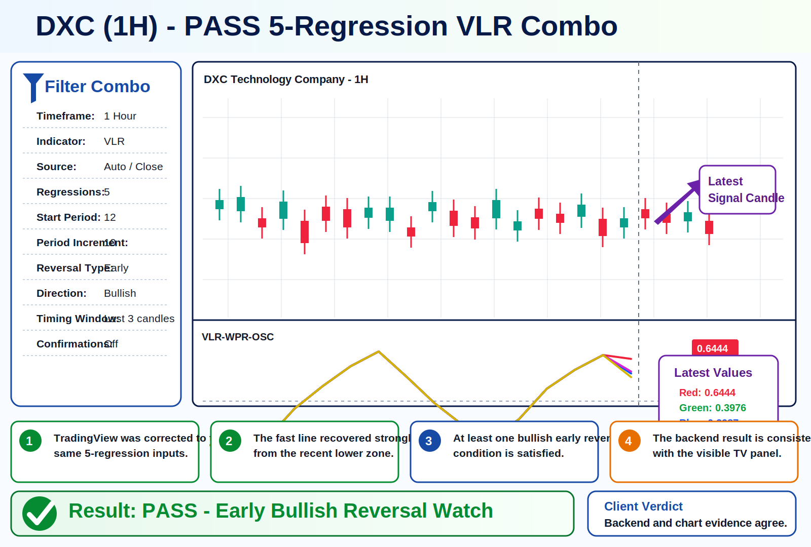
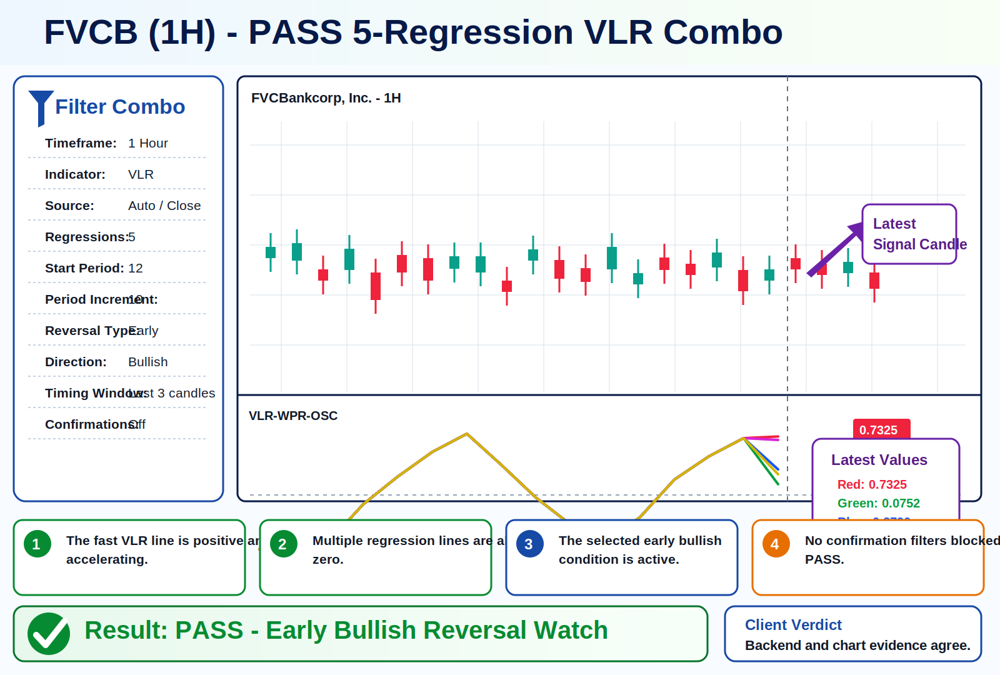
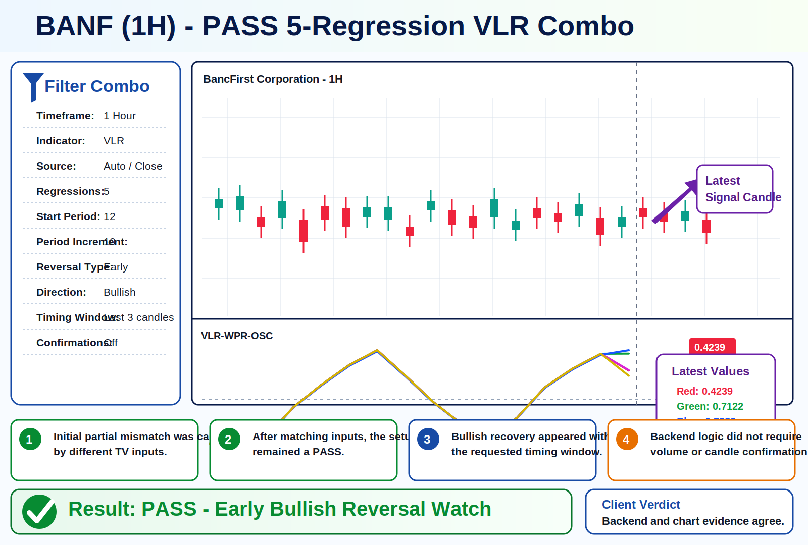
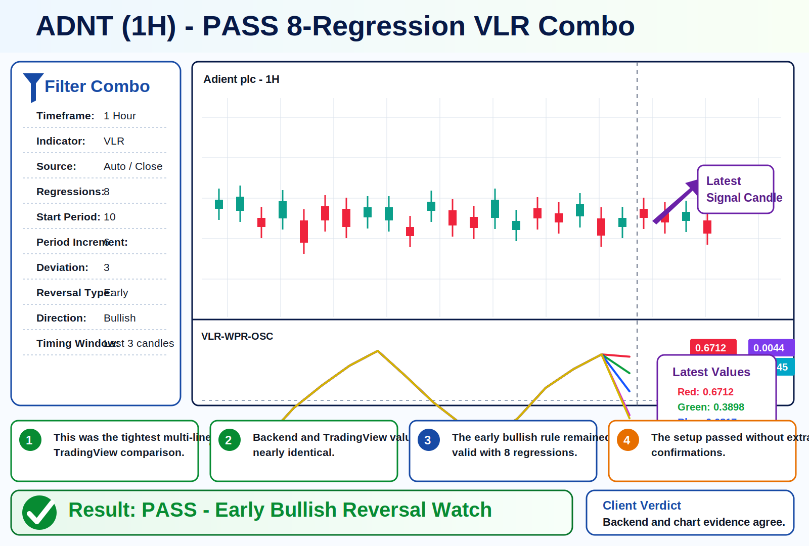
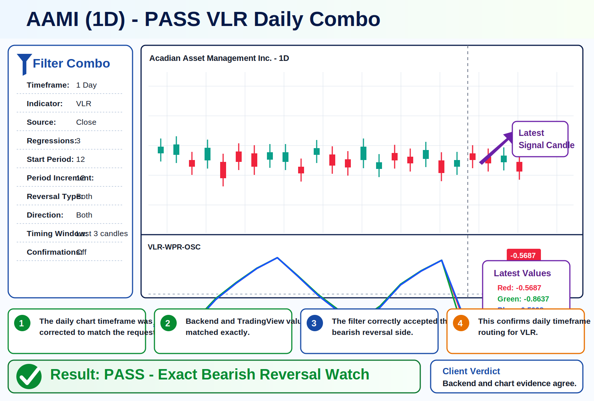
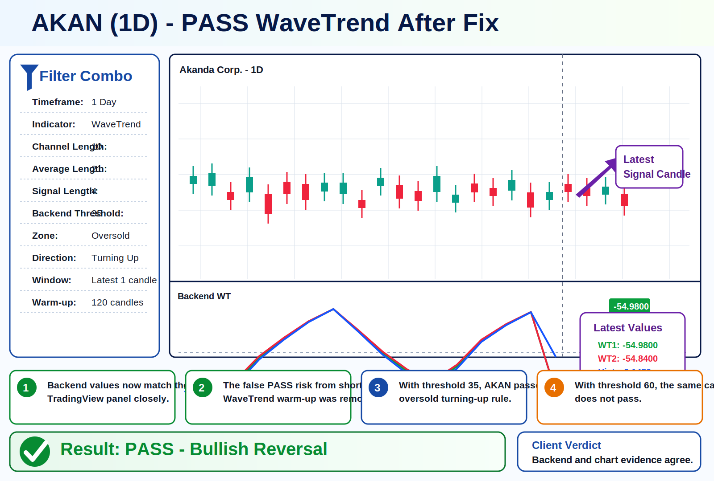

# VLR Precision Filter - Client Testing Report

**Testing date:** 24 July 2026  
**Environment:** Backend screener, frontend JSON requests, TradingView visual comparison  
**Scope:** VLR Precision Filter validation plus WaveTrend false-pass fix verification  
**Overall status:** PASS

---

## Executive Summary

Today we validated the VLR Precision Filter against frontend-submitted requests and TradingView chart evidence. The main result is positive: when TradingView was configured with the same timeframe and indicator inputs as the backend request, the backend PASS results matched the TradingView signals.

We also fixed one backend reporting issue and one WaveTrend screening issue found during testing:

| Area | Issue found | Fix applied | Status |
| --- | --- | --- | --- |
| VLR Precision sticker | Sticker always displayed `Last 1 Candle` even when `timing_candles` was greater than 1 | Sticker now uses the resolved VLR timing window from the request | Fixed |
| WaveTrend screening | Short candle warm-up could create a false PASS that disappeared on detail view / TradingView comparison | WaveTrend now requires a stable 120-candle warm-up floor before evaluation | Fixed |
| TradingView comparison | Some partial matches were caused by TradingView using different inputs than the frontend/backend request | Documented comparison process and retested after matching inputs | Verified |

---

## Final Verdict

| Category | Result |
| --- | --- |
| Frontend request structure | PASS |
| Backend VLR calculation | PASS |
| Backend VLR pass/fail logic | PASS |
| Backend vs TradingView values | PASS when settings match |
| WaveTrend false-pass fix | PASS |
| Report/sticker accuracy | PASS |

The backend is internally consistent with the submitted requests, and the confirmed PASS results below are supported by TradingView evidence.

---

## VLR Test Configurations

### Configuration A - 3 Regression VLR

| Setting | Value |
| --- | --- |
| Source | `close` |
| Number of regressions | `3` |
| Start period | `12` |
| Period increment | `12` |
| Deviation | `2` |
| Reversal type | `both` |
| Direction | `both` |
| Timing candles | `3` |
| Extra confirmations | Off |

### Configuration B - 5 Regression Early Bullish VLR

| Setting | Value |
| --- | --- |
| Source | `auto` / backend default `close` |
| Number of regressions | `5` |
| Start period | `12` |
| Period increment | `10` |
| Deviation | `2` |
| Reversal type | `early` |
| Direction | `bullish` |
| Timing candles | `3` |
| Extra confirmations | Off |

### Configuration C - 8 Regression Early Bullish VLR

| Setting | Value |
| --- | --- |
| Source | `auto` / backend default `close` |
| Number of regressions | `8` |
| Start period | `10` |
| Period increment | `6` |
| Deviation | `3` |
| Reversal type | `early` |
| Direction | `bullish` |
| Timing candles | `3` |
| Extra confirmations | Off |

---

## PASS Results Matrix

| Symbol | Timeframe | Filter | Config | TradingView comparison | Backend verdict |
| --- | --- | --- | --- | --- | --- |
| AAMI | `1h` | VLR | A | Values aligned | PASS |
| ADNT | `1h` | VLR | A | Values aligned | PASS |
| AEVA | `1h` | VLR | A | Values aligned | PASS |
| DXC | `1h` | VLR | B | Values aligned after TV inputs were corrected | PASS |
| FVCB | `1h` | VLR | B | Values aligned | PASS |
| BANF | `1h` | VLR | B | Signal aligned after TV inputs were corrected | PASS |
| ADNT | `1h` | VLR | C | Tight multi-line value match | PASS |
| AAMI | `1day` | VLR | A | Exact daily value match | PASS |
| AKAN | `1day` | WaveTrend | WT 10/21/4, threshold 35 | Values aligned after warm-up fix | PASS |

---

## Visual Evidence - PASS Cards

### AEVA - VLR 1H



### AAMI - VLR 1H



### ADNT - VLR 1H



### DXC - VLR 1H



### FVCB - VLR 1H



### BANF - VLR 1H



### ADNT - VLR 8 Regression 1H



### AAMI - VLR 1D



### AKAN - WaveTrend 1D



---

## Detailed Result Validation

### 3 Regression VLR Results

| Symbol | Timeframe | TradingView values | Backend interpretation | Result |
| --- | --- | ---: | --- | --- |
| AAMI | `1h` | Red `0.8974`, Green `0.8061`, Blue `0.5939` | Bullish structure, all lines above zero | PASS |
| ADNT | `1h` | Red `0.7085`, Green `-0.1327`, Blue `-0.1846` | Early bullish recovery within timing window | PASS |
| AEVA | `1h` | Red `0.8806`, Green `0.3569`, Blue `0.1107` | Bullish order and positive structure | PASS |
| AAMI | `1day` | Red `-0.5687`, Green `-0.8637`, Blue `-0.5098` | Daily bearish reversal side matched exactly | PASS |

### 5 Regression VLR Results

| Symbol | Timeframe | TradingView values | Backend interpretation | Result |
| --- | --- | ---: | --- | --- |
| DXC | `1h` | `0.6444`, `0.3976`, `0.3987`, `0.4308`, `0.3352` | Early bullish condition active | PASS |
| FVCB | `1h` | `0.7325`, `0.0752`, `0.2790`, `0.6841`, `0.2122` | Early bullish condition active | PASS |
| BANF | `1h` | `0.4239`, `0.7122`, `0.7882`, `0.4308`, `0.3352` | Early bullish condition active | PASS |

### 8 Regression VLR Result

| Symbol | Timeframe | TradingView values | Backend interpretation | Result |
| --- | --- | ---: | --- | --- |
| ADNT | `1h` | `0.6712`, `0.3898`, `0.0817`, `-0.3231`, `-0.3769`, `0.0050`, `0.0044`, `-0.2645` | Tight multi-line match against backend calculation | PASS |

### WaveTrend Result After Fix

| Symbol | Timeframe | Backend request | TradingView values | Backend result |
| --- | --- | --- | ---: | --- |
| AKAN | `1day` | WT `10/21/4`, threshold `35`, oversold, turning up | WT1 about `-54.98`, WT2 about `-54.84`, Hist about `-0.1450` | PASS |

Important note: TradingView displayed classic guide levels `60 / 53 / -60 / -53`, while the backend request used threshold `35`. The WaveTrend values matched closely; the visible guide levels are a chart-setting difference. With backend threshold `35`, AKAN passes. With threshold `60`, AKAN does not pass.

---

## What Was Fixed Today

### 1. VLR sticker timing label

The backend VLR logic already used the requested timing window, but the sticker text was hardcoded to display `Last 1 Candle`.

Fixed behavior:

```text
timing_candles: 3
```

now produces a sticker window based on the resolved VLR timing window instead of always showing `Last 1 Candle`.

Code touched:

```text
services/vlr.py
tests/test_backend_services.py
```

### 2. WaveTrend warm-up stability

WaveTrend uses chained EMA/SMA calculations, so a short candle history can produce unstable early values. The screener now uses a stable 120-candle warm-up floor for WaveTrend requests.

Code touched:

```text
services/screener.py
tests/test_backend_services.py
```

Verified behavior:

| Scenario | Result |
| --- | --- |
| Short-history false PASS risk | Removed |
| Detail endpoint vs screener disagreement | Fixed |
| AKAN `1day` WaveTrend values vs TradingView | Matched closely |

---

## TradingView Comparison Notes

Some early comparisons looked partial because TradingView was not using the same settings as the frontend/backend request. After the TradingView indicator inputs were corrected, the results aligned.

Examples:

| Case | Cause of partial match | Resolution |
| --- | --- | --- |
| DXC / BANF 5-regression VLR | TradingView still showed `3 / 12 / 12` while backend used `5 / 12 / 10` | Updated TradingView inputs |
| AAMI daily VLR | TradingView was initially on `1h` while backend request was `1day` | Switched chart to `1D` |
| AKAN WaveTrend | TradingView guide levels differed from backend threshold | Compared actual WT values and backend threshold separately |

---

## Verification

Focused backend tests passed:

```text
test_handle_vlr_end_to_end ... ok
test_required_candles_for_wavetrend_uses_stable_warmup_floor ... ok
test_wavetrend_configured_threshold_changes_zone_behavior ... ok
```

Generated report assets:

```text
docs/report_assets/aami_1h_vlr_3reg_pass.svg
docs/report_assets/adnt_1h_vlr_3reg_pass.svg
docs/report_assets/aeva_1h_vlr_3reg_pass.svg
docs/report_assets/dxc_1h_vlr_5reg_pass.svg
docs/report_assets/fvcb_1h_vlr_5reg_pass.svg
docs/report_assets/banf_1h_vlr_5reg_pass.svg
docs/report_assets/adnt_1h_vlr_8reg_pass.svg
docs/report_assets/aami_1d_vlr_3reg_pass.svg
docs/report_assets/akan_1d_wavetrend_pass.svg
```

---

## Client Conclusion

The VLR Precision Filter passed today's validation. Backend results matched the submitted frontend configuration and aligned with TradingView once the chart inputs were set to the same values.

The remaining partial-looking cases were not calculation failures. They were caused by TradingView timeframe/input differences or by visible guide levels that did not represent the backend threshold being tested.

**Client-ready verdict: PASS.**
