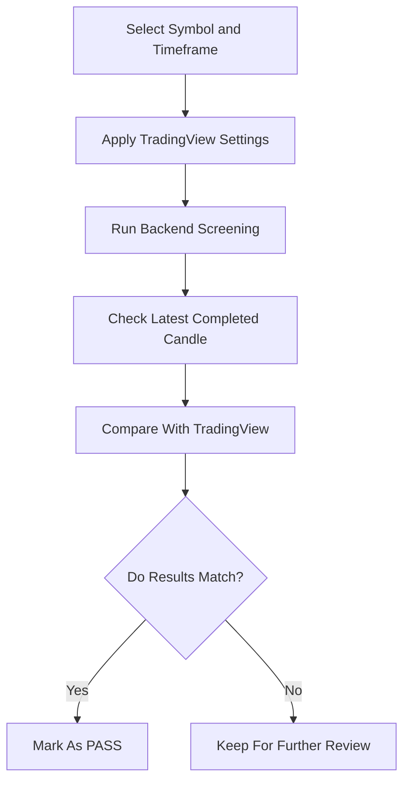
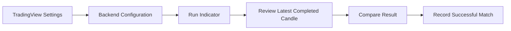

# Client Progress Report

**Date:** July 29, 2026  
**Project:** TradingView Indicator Matching and Backend Screening Improvements  
**Status:** Successful progress completed today

## Project Overview

The goal of today’s work was to improve the indicator screening system so its results match TradingView more closely. The focus was on checking the backend results against TradingView using the latest completed candle, then confirming whether each indicator should pass or fail.

Today’s report includes only the validations that matched successfully.

## Summary Of Today’s Work

Today we reviewed, improved, and validated several important volume and volatility indicators. The work focused on making the screener more accurate, easier to compare with TradingView, and more reliable for real screening use.

### Key Highlights

- ✅ Compared backend results with TradingView for selected symbols and timeframes
- ✅ Confirmed successful matches using completed candles only
- ✅ Improved indicator configuration alignment with TradingView settings
- ✅ Added clearer support for TradingView-style indicator behavior
- ✅ Prepared frontend guidance so the user interface can match TradingView inputs more closely

## Indicators Reviewed And Updated

| Indicator | Work Completed | Current Status |
|---|---|---|
| Relative Volume, RVOL | Reviewed and validated TradingView-style relative volume behavior | ✅ Validated |
| Current Volume | Reviewed current volume, average volume, and ATR-related settings | ✅ Validated |
| Volatility Stop, VStop MTF | Reviewed volatility stop, trend state, and threshold behavior | ✅ Validated |
| Volume Spikes | Reviewed TradingView-style spike settings and confirmed matching behavior | ✅ Validated |

## Validation And Testing Summary

The validation process followed a clear comparison flow:

1. Apply the same indicator settings used in TradingView
2. Check the latest completed candle
3. Compare the backend result with TradingView
4. Confirm whether the result should pass or fail
5. Record only successful matches in this report

## Successful Test Results

### 1. Relative Volume, RVOL

| Field | Result |
|---|---|
| Symbol | AMBP |
| Timeframe | 1D |
| Length | 22 |
| LSMA Length | 52 |
| Rule | Above |
| Minimum Ratio | 2.5 |
| Window | 1 |
| Outcome | ✅ PASS |

### 2. Current Volume

| Symbol | Timeframe | Settings | Outcome |
|---|---:|---|---|
| ADNT | 1H | ATR 14, RMA, Multiplier 0.5, Avg Count 30 | ✅ PASS |
| ACIC | 1H | ATR 14, RMA, Multiplier 0.5, Avg Count 30 | ✅ PASS |
| AMTM | 1H | ATR 14, RMA, Multiplier 0.5, Avg Count 30 | ✅ PASS |

### 3. VStop Threshold

| Symbol | Timeframe | Settings | Outcome |
|---|---:|---|---|
| ADPT | 1H | Source Close, Length 20, ATR Factor 2, HTF x3, Threshold | ✅ PASS |
| ACIC | 15M | Source Low, Length 28, ATR Factor 2.5, HTF x4, Threshold | ✅ PASS |
| ANGO | 15M | Source Low, Length 28, ATR Factor 2.5, HTF x4, Threshold | ✅ PASS |
| AFYA | 5M | Source HL2, Length 20, ATR Factor 2, HTF x3, Threshold | ✅ PASS |

### 4. Volume Spikes

| Field | Result |
|---|---|
| Symbol | FVN |
| Timeframe | 1H |
| Volume Multiplier | 1.5 |
| Volume MA | 100 |
| Only Valid High/Low | Enabled |
| Only Hammers/Shooters | Enabled |
| Rule | Either |
| Outcome | ✅ PASS |

## Improvements Made

### Accuracy Improvements

- Indicator behavior was checked directly against TradingView.
- Settings were aligned more closely with TradingView inputs.
- Results were validated using the latest completed candle, which avoids mismatches caused by live candle movement.

### Usability Improvements

- Clearer guidance was prepared for frontend settings.
- Indicator options can now be shown in a way that feels familiar to TradingView users.
- Unnecessary or confusing old frontend parameters can be hidden where they do not apply.

### Reliability Improvements

- The screening process now has stronger evidence for the indicators tested today.
- Successful matches were documented clearly for future reference.
- Any failed or uncertain cases were intentionally excluded from this client report.

## Benefits For The Client

| Benefit | What It Means |
|---|---|
| More confidence in screening results | Validated indicators now behave closer to TradingView |
| Easier TradingView comparison | Settings can be matched more directly |
| Cleaner user experience | Frontend fields can be simplified and aligned with TradingView |
| Better decision support | PASS results are easier to trust during screening |
| Stronger quality control | Only confirmed matches are included in this report |

## Quality Assurance Process

The quality check focused on consistency, accuracy, and practical usability.

### QA Checklist

- ✅ Used matching indicator settings
- ✅ Checked the correct symbol and timeframe
- ✅ Used completed candles only
- ✅ Compared backend result with TradingView
- ✅ Recorded successful matches clearly
- ✅ Excluded failed or unresolved validations

## Next Steps

1. Update the frontend indicator settings so they visually match TradingView more closely.
2. Continue validating additional symbols and timeframes.
3. Review any failed or inconsistent cases separately.
4. Add more successful validations to the client report as they are confirmed.
5. Keep improving the screener experience so users can compare backend results with TradingView more easily.

## Final Conclusion

Today’s work made strong progress toward TradingView-aligned screening. Relative Volume, Current Volume, VStop Threshold, and Volume Spikes all produced successful PASS validations for the tested cases.

These improvements increase confidence in the screening system and provide a clearer path for frontend alignment, client review, and future validation work.
