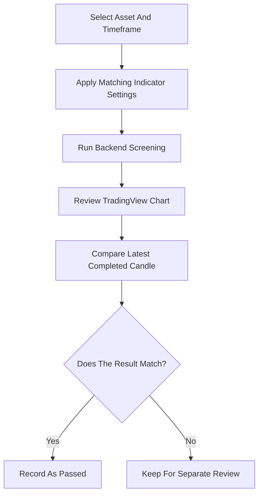

# Client Progress Report

**Date:** July 30, 2026  
**Project:** TradingView Indicator Validation and Screening Accuracy  
**Status:** ✅ Successful validations completed

## Project Overview

Today’s work focused on validating backend screening behavior against TradingView. The goal was to confirm that selected indicator configurations produce the same expected results when compared with TradingView charts.

Only successful validations are included in this report.

## Summary Of Today’s Work

Several screening combinations were reviewed using matching TradingView settings. The successful results confirm stronger alignment between the screening system and TradingView for Trendy ADX and channel-based validation.

### Highlights

- ✅ Confirmed multiple Trendy ADX results against TradingView
- ✅ Validated Linear Regression Channel respect behavior
- ✅ Reviewed Trend Channel respect behavior
- ✅ Verified ADX Above logic when no extra conditions are applied
- ✅ Confirmed that passed results match expected TradingView behavior

## Indicators Reviewed And Improved

| Indicator | Improvement Summary | Client Benefit |
|---|---|---|
| Trendy ADX | Improved confidence in ADX Above screening using TradingView-matched settings | More reliable trend-strength filtering |
| Linear Regression Channel | Confirmed channel respect behavior using TradingView-aligned channel settings | Better confidence when screening for support or resistance respect |
| Trend Channel Respect | Reviewed channel respect behavior for consistency | More dependable channel-based screening decisions |

## Passed Validation Results

| # | Indicator | Asset Tested | Timeframe | Parameter / Filter Combination | Status |
|---:|---|---|---|---|---|
| 1 | Trendy ADX | ATRC | 15m | Length 11, Rule `adx_above`, Threshold 20, Window 1 | ✅ Passed |
| 2 | Trendy ADX | APAM | 15m | Length 14, Rule `adx_above`, Threshold 20, Window 1 | ✅ Passed |
| 3 | Trendy ADX | ALGUSD | 15m | Length 11, Rule `adx_above`, Threshold 20, Window 1 | ✅ Passed |
| 4 | Trendy ADX | APPSTOCKUSDT | 15m | Length 11, Rule `adx_above`, Threshold 20, Window 1 | ✅ Passed |
| 5 | Linear Regression Channel | BZUN | 15m | Lower line, Wick touch, Minimum respects 2 | ✅ Passed |

## Testing And Validation Summary

Each passing result was checked using the matching TradingView chart and indicator settings. The review focused on the latest completed candle so that live candle movement did not affect the comparison.

### QA Checklist

- ✅ Used matching TradingView settings where applicable
- ✅ Compared the backend result with the TradingView chart
- ✅ Checked the correct asset and timeframe
- ✅ Focused on completed candle behavior
- ✅ Included only successful validation results
- ✅ Excluded failed or unresolved cases from this report

## Validation Workflow

## Benefits For The Client

| Benefit | What It Means |
|---|---|
| Greater result confidence | Passed configurations now have TradingView-backed validation |
| Better screening accuracy | Trend and channel filters are behaving closer to expected chart behavior |
| Easier review process | Results can be compared using clear settings and timeframes |
| Cleaner decision-making | Only validated passing combinations are included here |
| Stronger foundation for future testing | Confirmed cases can be used as reference examples |

## Next Steps

1. Continue validating additional Trendy ADX combinations.
2. Expand channel respect testing across more assets and timeframes.
3. Review any failed or inconsistent cases separately.
4. Align frontend indicator settings with the validated TradingView-style parameters.
5. Add more confirmed passing cases to the client validation history.

## Final Conclusion

Today’s validation confirmed multiple successful matches between the backend screener and TradingView. Trendy ADX passed across several 15-minute test cases, and Linear Regression Channel respect also produced a successful validation.

These results improve confidence in the screening system and support continued progress toward TradingView-aligned indicator behavior.
