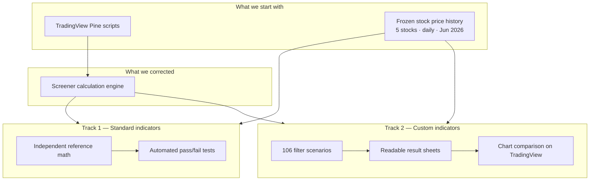
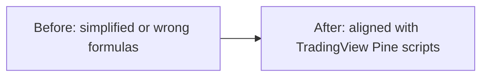
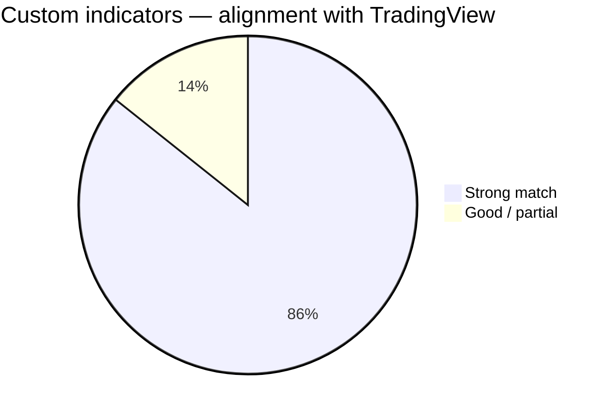

# Stock Screener Validation — Master Progress Summary


## Executive summary

We set out to answer a simple business question:

> **When a user runs a filter in the screener, do they get the right stocks — the same stocks they would expect from the charts they trust on TradingView?**

Two validation tracks were built:

| Track | What it checks | Status |
|-------|----------------|--------|
| **Standard indicators** (RSI, MACD, EMA, Aroon) | Automated offline tests using industry-standard math | **Built and running** |
| **Custom TradingView indicators** (WaveTrend, channels, LinReg, volume, volatility) | Fixed market data + side-by-side chart review | **Built; spot checks passing** |

**Bottom line for the client:** The screener engine was brought in line with TradingView Pine scripts for all seven custom indicators. A repeatable validation process now exists so future changes can be checked before release.

---

## The big picture



---

## Track 1 — Standard indicators (TA-Lib plan)

**Goal:** Prove the screener returns the correct stock list for RSI, Aroon, MACD, and EMA — automatically, without opening charts.

### What was delivered

```text
Frozen market data (saved once)
        │
        ├── Independent reference  ──►  Expected stock list
        │
        └── Real screener app      ──►  Actual stock list
                    │
                    ▼
            Do they match exactly?
```

| Component | What it does | Status |
|-----------|--------------|--------|
| Saved price dataset | Same candles every run; no live API calls during tests | Done |
| Rule definitions | Every filter setting written down explicitly | Done |
| Independent checker | Separate math library (TA-Lib) for RSI/MACD/EMA/Aroon | Done |
| Real screener runner | Runs the actual app code on saved data | Done |
| Combination tests | 15 ways to mix RSI, MACD, EMA, Aroon | Done |
| RSI deep matrix | 19 focused RSI filter scenarios | Done |
  | Pass/fail reports | JSON + readable summaries per scenario | Done |

**Location:** `backend/production_screener_validation/`

**First milestone from the plan:** Complete for standard indicators on daily timeframe with five test stocks.

---

## Track 2 — Custom TradingView indicators

**Goal:** Confirm the seven custom chart indicators behave like TradingView when users apply filters.

### The seven indicators

| Indicator | TradingView source | Match quality after fixes |
|-----------|-------------------|---------------------------|
| WaveTrend | LazyBear | Strong |
| LinReg Candles | Humble LinReg Candles | Strong |
| Linear Regression Channel | jwammo12 | Strong |
| Regression Channel [DW] | Donovan Wall | Strong |
| Trend Channels | ChartPrime | Strong (channel shape); liquidity label partial |
| Relative Volume | RelVol (stocks) | Strong |
| Volatility study | Custom study | Good (daily/range modes); calendar week/month partial |

### What was delivered

```text
Saved June 2026 daily data (5 stocks)
        │
        ▼
106 filter scenarios  ──►  Screener runs each scenario
        │
        ▼
Per-scenario reports: which stocks PASS / FAIL
        │
        ▼
TradingView checklists  ──►  You verify on charts · mark agree / disagree
```

| Deliverable | Count / location |
|-------------|------------------|
| Filter scenarios | **106** cases in `backend/production_screener_validation/cases/` |
| Run reports | `backend/production_screener_validation/reports/custom/all_minimal/` |
| Client-friendly checklists | `docs/pinescript/tv_validation/` (7 sheets + README) |

**Important:** For custom indicators we compare **production screener output vs your TradingView charts** — not two copies of our own code. That is the meaningful check for chart parity.

---

## What was wrong — and what we fixed

Before July 2026, several screener calculations did **not** follow the TradingView scripts. Users could see one thing on a chart and get different scan results.

### Plain-English summary of corrections



| Area | Problem (before) | Fix (after) |
|------|------------------|-------------|
| **WaveTrend** | Alert levels used 35 instead of TradingView’s 60 | Default zone now ±60; values match TV (e.g. WT1 44.70, WT2 37.35 on AMD Jun 30) |
| **LinReg Candles** | Only close price regressed; wrong smoothing length | Full OHLC regression; signal length 11; values match TV candle body |
| **Linear Regression Channel** | Wrong band math | Matches jwammo12 rolling regression bands |
| **DW Regression Channel** | Simple straight-line fit instead of Donovan Wall method | Filtered regression channel (SMA default) |
| **Trend channels** | Slope check too simplistic | Matches ChartPrime pivot channel logic |
| **Relative volume** | 20-bar average instead of TV’s 10 | Same formula as `volume / average of prior 10 bars` |
| **Volatility** | Wrong metric (price change spread) | Range-based volatility like the Pine study |

All fixes live in the production screener. Details: `docs/pinescript/fix_summary.md` and `docs/pinescript/comparison.md`.

---

## Manual chart verification — spot checks (July 2026)

These were checked on **TradingView 1D charts** against saved data for **AMD**, evaluation bar **30 June 2026** (or “latest” = same date).

| Indicator | What we compared | Result |
|-----------|------------------|--------|
| **LinReg Candles** | Synthetic candle OHLC + signal line | **Match** — e.g. O 528.46, H 548.39, L 512.67, C 546.51; AMD passes “above line” filters as expected |
| **WaveTrend** | WT1 / WT2 | **Match** — WT1 44.70, WT2 37.35; no stocks pass oversold/overbought on that bar (correct — not in ±60 zone) |
| **DW Regression** | Channel lines vs price | **Match** — price far above upper band; “touch upper” filters correctly show no passes (touch ≠ above) |

**How to read PASS / FAIL in reports**

- **PASS** = stock **matches** that filter (screener **includes** it).  
- **FAIL** = stock **does not match** (screener **excludes** it).  
- This is **not** a failed test — it is the expected outcome when a filter is strict.

---

## Current status at a glance



| Workstream | Planned | Done | Remaining |
|------------|---------|------|-----------|
| TA-Lib framework + fixtures | Yes | Yes | Expand symbol universe (optional) |
| RSI / MACD / EMA / Aroon automation | Yes | Yes | Gate/entry multi-timeframe (later phase) |
| Custom indicator math fixes | Yes | Yes | Minor gaps (see below) |
| 106 custom filter scenarios | Yes | Yes | Optional combo scenarios later |
| TradingView checklists | Yes | Yes | Continue marking agree/disagree per case |
| Full automated TV comparison | No | N/A | By design — charts verified manually |

### Known small gaps (documented, not blockers)

| Item | Impact |
|------|--------|
| WaveTrend secondary level (53 vs 60) | Configurable; default is 60 |
| Crypto volume in USD | Stock RelVol only for now |
| Volatility calendar weeks/months | Fixed bar window used instead |
| Trend channel “liquidity” label | Break detection matches; label text differs slightly |

---

## Where everything lives

| For you | Path |
|---------|------|
| **TradingView checklists** (start here for chart review) | `docs/pinescript/tv_validation/` |
| **Detailed run results** (OHLC + pass lists per scenario) | `backend/production_screener_validation/reports/custom/all_minimal/cases/` |
| **What we fixed** (technical changelog) | `docs/pinescript/fix_summary.md` |
| **Before/after parity table** | `docs/pinescript/comparison.md` |
| **Custom indicator plan** (implemented) | `docs/architecture/custom_indicator_plan.md` |
| **Standard indicator plan** | `docs/architecture/TALIB_plan.md` |

### Run the custom indicator suite again

From project root:

```text
make custom-indicator-tv
```

This regenerates scenarios, runs the screener on saved data, and refreshes the TradingView checklists.

---

## What this means for the product

1. **Trust** — Scan results for custom indicators can be traced back to the same logic traders see on TradingView.  
2. **Repeatability** — June 2026 data and 106 scenarios are frozen; reruns do not depend on live market feeds.  
3. **Regression safety** — Standard indicators have automated gates; custom indicators have checklist-driven chart review.  
4. **Transparency** — Every scenario states which stocks pass, on which date, with enough detail to verify on a chart in minutes.

---

## Recommended next steps

| Priority | Action | Owner |
|----------|--------|-------|
| 1 | Work through `docs/pinescript/tv_validation/*.md` and mark agree/disagree | Validation / product |
| 2 | Prioritize any disagree rows for engineering follow-up | Engineering |
| 3 | Expand saved stock universe beyond 5 names when ready | Data / engineering |
| 4 | Add automated CI run for standard indicator suite on each release | DevOps |

---

## Document map

```text
VALIDATION_APPROCH_MASTER.md     ← You are here (overview)
        │
        ├── TALIB_plan.md              Standard indicator automation plan
        ├── custom_indicator_plan.md   Custom indicator + TV review plan
        │
        ├── comparison.md              Parity status per indicator
        ├── fix_summary.md             Engineering fix log
        │
        └── tv_validation/             Client-facing chart checklists
```

---

*Last updated: July 2026 — reflects implemented validation work and spot-checked TradingView comparisons on AAPL, AMD, MSFT, NVDA, TSLA (daily, June 2026 window).*
