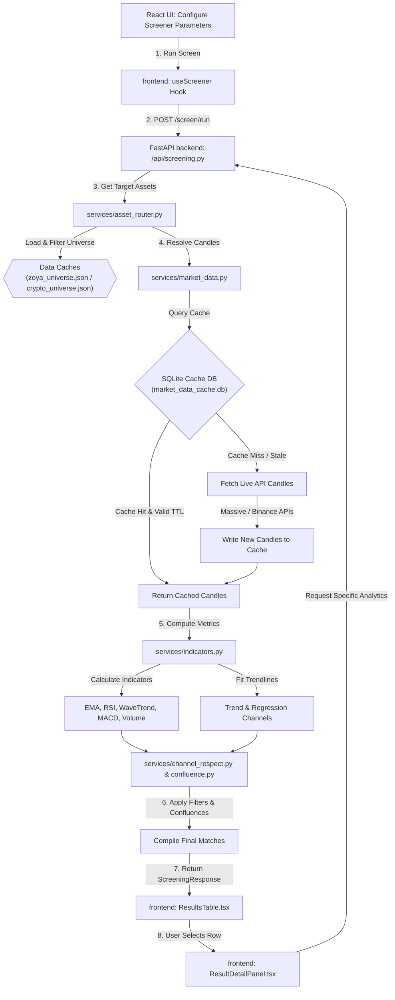

# Application Architecture

This document describes the core architecture, data pipelines, external APIs, and the process flow of the Shariah-Compliant Crypto & Stock Screening System.

## About the Application
The Screening System is a professional-grade web application designed to help users identify and analyze trade setups in stock and crypto markets. By combining custom technical analysis indicators (e.g., RSI, WaveTrend, EMA crossovers) and Trend/Regression Channel respect rules with Shariah-compliance filters (halal stock compliance status sourced via Zoya), the application offers screening capabilities tailored to ethical and strategy-driven traders.

---

## APIs and External Integrations
The application integrates with the following external APIs and services:

* **Zoya API (GraphQL)**: Sourced to update the universe of Shariah-compliant (halal) stocks, including report dates, compliance status, and dividend purification ratios.
* **Massive / Polygon API**: Serves as the primary data provider for reference tickers (equity and crypto universes) and live/historical price candle data.
* **CryptoCompare API**: Used by backend universe compilation scripts to retrieve trading pair availability across multiple crypto exchanges (e.g., Binance, Gate.io).
* **Binance API**: Serves as a direct secondary crypto candle provider for high-speed retrieval of digital asset price action.
* **Firebase Authentication & Firestore**: Manages user account registration, login states, and user settings/presets persistently in the cloud.

---

## Complete Architecture Pipeline

The system utilizes an asynchronous, cache-first pipeline to process asset screening requests:

```
[React Frontend] (Index.tsx / useScreener)
      │
      │ 1. POST /screen/run (ScreeningRequest)
      ▼
[FastAPI Backend] (main.py -> api/screening.py)
      │
      │ 2. Filter Asset Universe
      ▼
[Asset Router] (asset_router.py)
      │ ── Loads: zoya_universe.json / crypto_universe.json
      │ ── Filters: Asset type, Exchange, and Compliance
      ▼
[Market Data Router] (market_data.py)
      │
      ├─► [Cache Lookups] (market_data_store.py / SQLite db)
      │       (Return cached candles if within TTL)
      │
      └─► [API Fetch Engine] (Massive/Polygon/Binance APIs)
              (Fetch live candles in parallel & cache to SQLite)
      │
      ▼
[Indicator Calculation Engine] (indicators.py / services/*)
      │ ── Calculates: RSI, WaveTrend, MACD, Volume, LRC, and EMA
      │ ── Fits: Trend Channels / Linear Regression Channels (regression_channels.py)
      │ ── Evaluates: Channel touches and respects (channel_respect.py)
      ▼
[Confluence Processor] (confluence.py)
      │ ── Filters assets matching multi-indicator signals (bullish/bearish)
      ▼
[API Response Handler]
      │ ── Sends structured ScreeningResponse back
      ▼
[React Frontend]
      │ ── Renders list in ResultsTable.tsx
      │ ── Clicking result displays real-time details in ResultDetailPanel.tsx
```

### Detailed Pipeline Stages
1. **User Request & Inputs**: The user configures strategy filters (asset type, exchange, timeframe, indicators, channel constraints) and clicks "Run". The frontend triggers `useScreener.ts` to dispatch an API call.
2. **Universe Selection**: The backend `asset_router.py` filters the full universe of assets down to a candidate list based on the chosen exchange and compliance settings.
3. **Data Loading (Cache-First)**: For each candidate asset, the system requests price candles. If the timeframe supports cached data, it queries the local SQLite data store. If the cache is stale or empty, a parallel fetch is dispatched to Massive/Binance, and cached back for subsequent runs.
4. **Technical Indicator Engine**: The raw candle data is parsed into NumPy arrays to calculate various mathematical indicators. In parallel, regression algorithms fit dynamic support and resistance lines to establish trend channels.
5. **Confluence Filter**: The screener evaluates each asset's indicator statuses. Only assets satisfying the designated confluence criteria (e.g. WaveTrend crossover inside a regression channel support boundary) are selected.
6. **Detail Render**: Selected matching results are returned to the frontend for display in the interactive table. Selecting an asset triggers a focused detail request to display the technical breakdowns visually.

---

## Process Flow Diagram

Here is a visual Mermaid diagram illustrating the complete step-by-step flow from UI input down to screening analysis:



---

## Frequently Asked Questions (FAQ)

### 1. Why are there two separate caches (Data Caches vs. SQLite Cache)?
The two caches serve entirely different scopes and performance optimization roles:

* **Data Caches (`zoya_universe.json` / `crypto_universe.json`)**:
  * **What they store**: 
    * `zoya_universe.json` stores the registry of stocks, including company `name`, ticker `symbol`, Shariah compliance `status` (compliant/non-compliant), `reportDate`, dividend `purificationRatio`, and trading `exchange`.
    * `crypto_universe.json` stores the registry of cryptocurrencies, including ticker `symbol`, `name`, custom categories, and an array of supported trading `exchanges`.
  * **Why we need them**: They act as the "universe registries". Instead of querying external APIs (Zoya GraphQL or CoinMarketCap) during a live screen to find out if a symbol exists, is tradeable on an exchange, or is halal, the system performs an instant offline lookup.
  * **How they are updated**: They are updated out-of-band by running backend admin scripts located in the `backend/scripts/` folder:
    * Run `python scripts/update_zoya_universe.py` to pull fresh compliance reports from the Zoya API.
    * Run `python scripts/update_crypto_universe.py` to refresh active digital tokens and their exchanges from CryptoCompare.
  * **Do we retrieve them from disk in every pipeline call?**: **No**. The backend loads these JSON files into memory (as global dictionaries) exactly once when the server starts or when they are first accessed (`services/asset_router.py`). Subsequent screening runs read them directly from fast server memory.

* **SQLite Cache (`market_data_cache.db`)**: This is a dynamic, transaction-supported database that caches *historical price candle data (OHLCV)* fetched from data providers. Because downloading candles for hundreds of assets on every single screen request is slow and subject to API rate limits, the SQLite cache stores recent candles with custom Timeframe-based TTL (Time-To-Live) constraints to ensure fast responses.


### 2. Why is fitting trendlines/regression channels mentioned separately from indicators?
* **Algorithms vs. Value Series**: Standard indicators (like RSI, MACD, WaveTrend, or EMAs) calculate simple point-in-time numeric output arrays derived from price series. Trendlines and regression channels, however, use line-fitting mathematical models (such as Least Squares Regression) to compute dynamic support/resistance geometric boundary vectors (slopes, intercepts, and deviations).
* **Sequential Dependency**: In the pipeline, trendline and regression boundaries must be fitted first because downstream filters (like `channel_respect.py` and `confluence.py`) evaluate price interaction rules (e.g. counting candle touch metrics or crossovers) relative to those specific boundaries.

