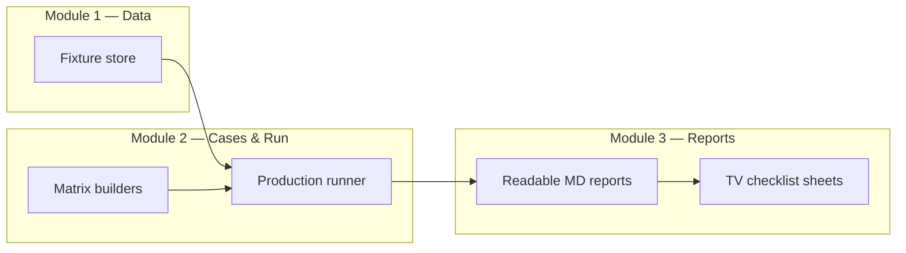

# Custom Indicator Validation Plan

Validate the seven Pine-backed custom indicators against TradingView by reusing frozen Massive candle data, running **production screener logic only**, and producing human-readable pass/fail sheets for **manual chart comparison**.

**Scope**

| Item | Value |
|------|-------|
| Symbols | AAPL, AMD, MSFT, NVDA, TSLA |
| Timeframe | 1 day |
| Evaluation window | 2026-06-01 → 2026-06-30 (walk-forward dates inside this range) |
| Indicators | All seven from [`docs/pinescript/comparison.md`](../pinescript/comparison.md) |
| Pine references | `docs/pinescript/*.md` |
| Verification | **Manual on TradingView** (you confirm pass/fail on charts) |

**Out of scope for this plan**

- Refetching Massive data (reuse existing fixture)
- `backend/validation/` Twelve Data pipeline (30min, RSI/MACD/EMA/Aroon only — different system)
- **Reference Oracle** (`reference/oracle.py`, `custom_engine.py`, `rule_engine.py`) — duplicate logic, not used for custom indicators here
- **Production vs oracle comparison** / golden approval workflow
- Automated TradingView scraping or API
- Crypto / RelVolForCEX USD conversion

---

## Architecture — 3 modules, 3 phases



| Module | Responsibility | Primary paths |
|--------|----------------|---------------|
| **M1 — Data** | Verify frozen candles; no live API | `backend/production_screener_validation/data/fixtures/` |
| **M2 — Cases & Run** | Generate case JSON; run production screener offline | `backend/scripts/`, `backend/production_screener_validation/production/runner.py` |
| **M3 — Reports** | Human-friendly MD for manual TV matching | `backend/production_screener_validation/reports/`, `docs/pinescript/tv_validation/` |

| Phase | Goal | Depends on |
|-------|------|------------|
| **P1** | Confirm fixture reuse | M1 |
| **P2** | Build minimal case matrices per indicator | M1 |
| **P3** | Run production + publish TV comparison sheets | P2 |

---

## Phase 1 — Data (reuse, do not refetch)

### Existing fixture (confirmed)

| Field | Value |
|-------|-------|
| `fixture_id` | `stocks_daily_2026_06_30_v1` |
| Path | `backend/production_screener_validation/data/fixtures/stocks_daily_2026_06_30_v1/` |
| Provider | Massive |
| Symbols | AAPL, AMD, MSFT, NVDA, TSLA |
| Timeframes | `1day` |
| History | 2025-04-01 → 2026-06-30 (includes full June 2026 evaluation window) |
| Metadata | `metadata.json` (compliance / exchange labels) |

Candles live at:

```
data/fixtures/stocks_daily_2026_06_30_v1/candles/1day/{SYMBOL}.json
```

### P1 tasks

1. Run fixture checksum verification via `FixtureStore.verify("stocks_daily_2026_06_30_v1")`.
2. If verification passes → **skip** `fetch_production_screener_fixtures.py`.
3. If verification fails → re-run fetch with identical parameters from README (same symbols, `--end 2026-06-30`, `--timeframes 1day`).

### Why not `backend/validation/`?

`backend/validation/spec.py` is a separate contract: fixed 30min bars, Twelve vs Massive numeric comparison for RSI/Aroon/MACD/EMA. Custom Pine indicators at **1day** use **`production_screener_validation`** fixtures plus **`ProductionRunner`** (real `services/screener.py` path).

---

## Phase 2 — Case matrices (filter combos)

Follow the RSI pattern:

- **Reference:** `backend/scripts/build_rsi_filter_matrix.py` → `cases/rsi_filter_minimal.json`
- **Structural combos (optional later):** `build_standard_screener_case_matrix.py` pattern

### Design principles (same as RSI minimal)

Each indicator gets a **`minimal`** mode (~15–25 cases), not a full Cartesian product:

1. **Tier 1 — Semantic core:** every meaningful UI zone / rule / direction pair.
2. **Tier 2 — One-factor-at-a-time (OFAT):** vary one parameter from Pine defaults.
3. **Tier 3 — Walk-forward:** pin `evaluation_date` to specific June 2026 bars where window/tolerance changes outcomes (mirror RSI `2026-06-01`, `2026-06-02`, `2026-06-30` pattern).

All cases share:

```json
{
  "fixture_id": "stocks_daily_2026_06_30_v1",
  "symbols": ["AAPL", "AMD", "MSFT", "NVDA", "TSLA"],
  "asset_type": "stocks",
  "timeframe_mode": "single",
  "single_timeframe": "1day",
  "stock_sources": ["zoya"]
}
```

### New scripts to add (one per indicator family)

| Script | Output case file | Indicator key |
|--------|------------------|---------------|
| `build_wavetrend_filter_matrix.py` | `cases/wavetrend_filter_minimal.json` | `wavetrend` |
| `build_lrc_filter_matrix.py` | `cases/lrc_filter_minimal.json` | `lrc` |
| `build_regression_filter_matrix.py` | `cases/regression_filter_minimal.json` | `regression` |
| `build_linreg_candles_filter_matrix.py` | `cases/linreg_candles_filter_minimal.json` | `linreg_candles` |
| `build_trend_filter_matrix.py` | `cases/trend_filter_minimal.json` | `trend` |
| `build_relative_volume_filter_matrix.py` | `cases/relative_volume_filter_minimal.json` | `relative_volume` |
| `build_volatility_filter_matrix.py` | `cases/volatility_filter_minimal.json` | `volatility` |

Optional aggregator:

| Script | Output |
|--------|--------|
| `build_custom_indicator_filter_matrix.py` | `cases/custom_indicators_minimal.json` (concat all seven suites) |

### Per-indicator minimal matrix outline

#### 1. WaveTrend (`wavetrend`)

Pine ref: `docs/pinescript/wavetrend.md` · Backend: `backend/services/wavetrend.py`

| Tier | Dimensions |
|------|------------|
| Core | `zone`: oversold / overbought × `direction`: any / crossed_up / crossed_down |
| OFAT | `threshold`: 60 (default), 53 · `channel_length`: 10 · `window`: 3 · `confirmation`: true |
| Walk-forward | `evaluation_date` on Jun 1, Jun 2, Jun 30 with `zone=oversold` + varying `window` |

Defaults: `channel_length=10`, `average_length=21`, `signal_length=4`, `threshold=60`.

#### 2. LRC (`lrc`)

Pine ref: `linear_regression_channel.md` · Backend: `regression_channels.py` → `compute_lrc_channel`

| Tier | Dimensions |
|------|------------|
| Core | `lines`: upper / middle / lower × `action`: touched / closed_above / closed_below |
| OFAT | `length`: 100 · `upper_dev`/`lower_dev`: 2.0 · `window`: 3 · `touch_type`: wick / body |
| Walk-forward | Jun dates where price touches upper or lower band |

Defaults: `length=100`, `upper_dev=2`, `lower_dev=2`.

#### 3. DW Regression (`regression`)

Pine ref: `regression_channel.md` · Backend: `compute_dw_regression_channel`

| Tier | Dimensions |
|------|------------|
| Core | `lines`: upper / middle / lower / q1 / q3 × `action`: touched |
| OFAT | `length`: 200 · `width_coeff`: 1.0 · `filter_type`: SMA / EMA · `window_type`: continuous |
| Walk-forward | Jun dates with quartile touch |

Defaults: `length=200`, `width_coeff=1.0`, `filter_type=SMA`, `window_type=continuous`.

#### 4. LinReg Candles (`linreg_candles`)

Pine ref: `linear_regression_candle.md` · Backend: `linear_regression_candles.py`

| Tier | Dimensions |
|------|------------|
| Core | `price_position`: above / below / touching × `close_location`: any / bullish / bearish |
| OFAT | `lr_length`: 11 · `signal_smoothing`: 11 · `sma_signal`: true/false · `window`: 3 · `tolerance_pct`: 5 |
| Walk-forward | Jun dates where close crosses signal line |

Defaults: `lr_length=11`, `signal_smoothing=11`, `sma_signal=true`, `lin_reg=true`.

#### 5. Trend Channel (`trend`)

Pine ref: `trend_channel.md` · Backend: `trend_channels.py`

| Tier | Dimensions |
|------|------------|
| Core | `areas`: top / mid / bottom × break-style actions · `direction`: up / down channel |
| OFAT | `length`: 8 · `wait_for_break`: true/false · `show_last_channel`: true |
| Walk-forward | Jun dates with documented pivot breaks on fixture symbols |

Defaults: `length=8`, `wait_for_break=true`.

#### 6. Relative Volume (`relative_volume`)

Pine ref: `relative_volumn.md` · Backend: `indicators.py` → `handle_relative_volume`

| Tier | Dimensions |
|------|------------|
| Core | Pass when ratio ≥ threshold (implicit filter) |
| OFAT | `length`: 10 · `min_ratio`: 1.0 / 1.5 / 2.0 |
| Walk-forward | Jun dates with known volume spikes (e.g. TSLA, NVDA event days) |

Defaults: `length=10`, `min_ratio=1.0`.

#### 7. Volatility (`volatility`)

Pine ref: `volatility.md` · Backend: `handle_volatility`

| Tier | Dimensions |
|------|------------|
| Core | `mode`: range_avg / daily · pass inside `[min_pct, max_pct]` band |
| OFAT | `length`: 20 · `min_pct` / `max_pct` sweeps · legacy `mode=returns_std` (document only, not TV parity) |
| Walk-forward | Jun dates at band boundaries |

Defaults: `mode=range_avg`, `length=20`.

### Cross-indicator combo suite (optional, phase 2b)

After single-indicator minimal suites pass manual TV review, add:

```
build_custom_indicator_combo_matrix.py → cases/custom_combinations_minimal.json
```

Pattern: same as `standard_combinations.example.json` (non-empty subsets), but **one canonical config per indicator** — consider capping to pairs + triples only.

---

## Phase 3 — Production run + manual TV reports

Run the **real backend only**. No oracle, no comparator, no golden files.

### Flow

```
FixtureStore.load(candles)
    → ProductionRunner.run_case(case)   # services/screener.py on frozen data
    → production-only report writer     # which symbols PASS + rule evidence
    → export TV checklist sheets        # docs/pinescript/tv_validation/
         → you verify on TradingView
```

### Runner note

Existing `run_production_screener_suite.py` calls `compare_case_direct()` (oracle vs production). For this plan, add either:

- **`--production-only`** flag on that script, or
- **New script:** `run_custom_indicator_suite.py` — calls `ProductionRunner.run_case()` directly and writes reports without expected/actual diff.

Reports should list **`production_symbols`** (stocks that pass the filter combo) — that is what you match on TradingView.

### Commands (implemented)

```powershell
# From repo root
make custom-indicator-tv

# Or step by step
python backend/scripts/build_custom_indicator_filter_matrix.py
python backend/scripts/run_custom_indicator_suite.py `
  --output backend/production_screener_validation/reports/custom/all_minimal
python backend/scripts/export_tv_validation_sheets.py `
  --reports-dir backend/production_screener_validation/reports/custom/all_minimal
```

### Report outputs

Per run:

```
reports/custom/<run>/cases/<case_id>.md    # human-readable: filter combo + passing symbols + values
reports/custom/<run>/cases/<case_id>.json
reports/custom/<run>/summary.md
```

TV checklists (consolidated for manual review):

```
docs/pinescript/tv_validation/
  wavetrend_minimal.md
  lrc_minimal.md
  regression_minimal.md
  linreg_candles_minimal.md
  trend_minimal.md
  relative_volume_minimal.md
  volatility_minimal.md
  README.md
```

Each checklist file should be scannable next to TradingView:

| Section | Content |
|---------|---------|
| **Setup** | Symbol, timeframe (1D), date range, Pine script name + input defaults |
| **Case table** | Case ID · filter description · **stocks that PASS (production)** · evaluation date |
| **Per symbol** | OHLCV for evaluation bar · indicator values from production · pass/fail |
| **TV steps** | Open chart → add indicator → match inputs → check bar → confirm pass/fail |
| **Known gaps** | Link to residual rows in `comparison.md` |
| **Your notes** | Space to mark TV agree / disagree |

Extend `readable_reports.py` (or a production-only variant) to format custom indicator values — today it pretty-prints RSI/MACD/EMA/Aroon only.

### What “pass” means

| Layer | Meaning |
|-------|---------|
| **Production pass** | Backend screener includes the symbol for that filter combo on the evaluation bar(s) |
| **TV pass (manual)** | You confirm the same symbol should pass on TradingView with matching Pine inputs |

Production output is the **candidate answer**. TradingView is the **authority** you verify against.

---

## Deliverables checklist

| # | Deliverable | Phase |
|---|-------------|-------|
| 1 | Fixture verified (no refetch) | P1 |
| 2 | 7 × `*_filter_minimal.json` case files | P2 |
| 3 | 1 × `custom_indicators_minimal.json` aggregator | P2 |
| 4 | `build_custom_indicator_filter_matrix.py` (+ per-indicator builders) | P2 |
| 5 | `run_custom_indicator_suite.py` (production-only runner) | P3 |
| 6 | Suite reports under `reports/custom/` | P3 |
| 7 | Extended report formatter for custom indicators | P3 |
| 8 | `docs/pinescript/tv_validation/*.md` TV checklists | P3 |
| 9 | `export_tv_validation_sheets.py` | P3 |

---

## Implementation order (recommended)

1. **P1** — Verify fixture checksums.
2. **P2a** — WaveTrend + LinReg Candles matrices first (clearest TV signals).
3. **P2b** — LRC + Regression + Trend (channel geometry).
4. **P2c** — Relative Volume + Volatility.
5. **P3** — Production-only runner + reports + TV export.
6. **Manual** — Spot-check 2–3 cases per indicator on TradingView; note mismatches in checklist files.
7. **P2 optional** — Cross-indicator combo matrix once singles are trusted on TV.

---

## Success criteria

- All seven indicators have a **minimal case suite** on frozen 1D June-capable data.
- Each case produces a **markdown report** listing which of the five symbols **production** passes.
- TV checklist docs let you verify pass/fail on TradingView in **under 2 minutes per case**.
- No Massive API calls during runs.
- Known non-parity items from `comparison.md` are documented in TV sheets.
- Manual TV notes captured (agree / disagree per case).

---

## Related files

| Path | Role |
|------|------|
| `backend/production_screener_validation/README.md` | Existing package docs (RSI/golden workflow — not used here) |
| `backend/production_screener_validation/production/runner.py` | **Production runner** — real screener on fixtures |
| `backend/scripts/build_rsi_filter_matrix.py` | Template for minimal matrix generation |
| `backend/production_screener_validation/comparison/readable_reports.py` | Per-case markdown formatter (extend for custom indicators) |
| `backend/services/*.py` | Indicator compute + filter logic (source of truth) |
| `docs/pinescript/comparison.md` | Indicator list + parity status |
| `docs/pinescript/fix_summary.md` | Backend implementation changelog |

---

*Implemented 2026-07-15. See commands below.*

